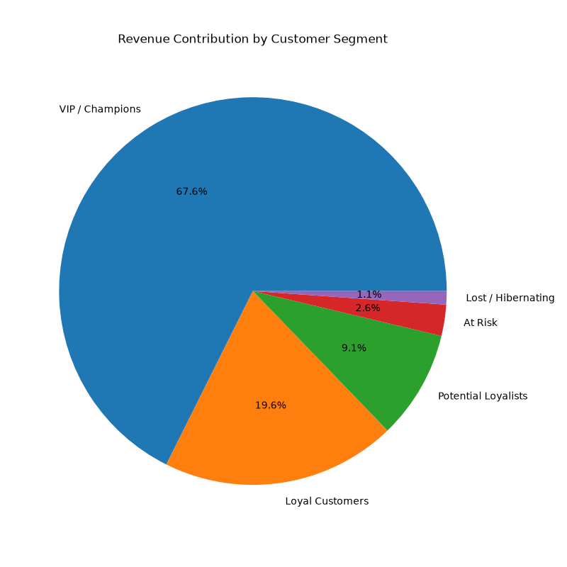
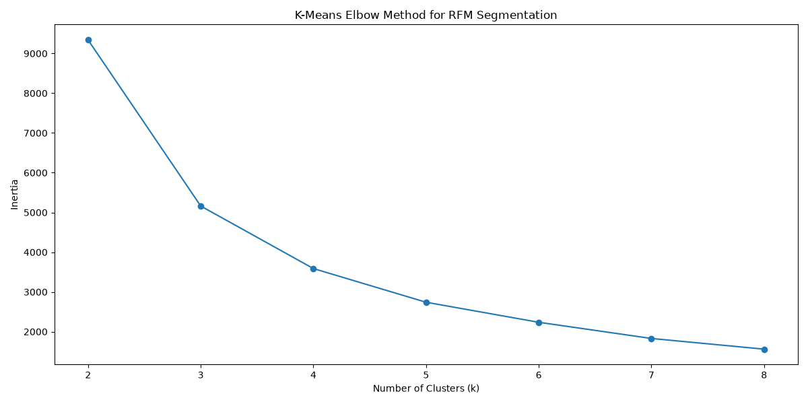
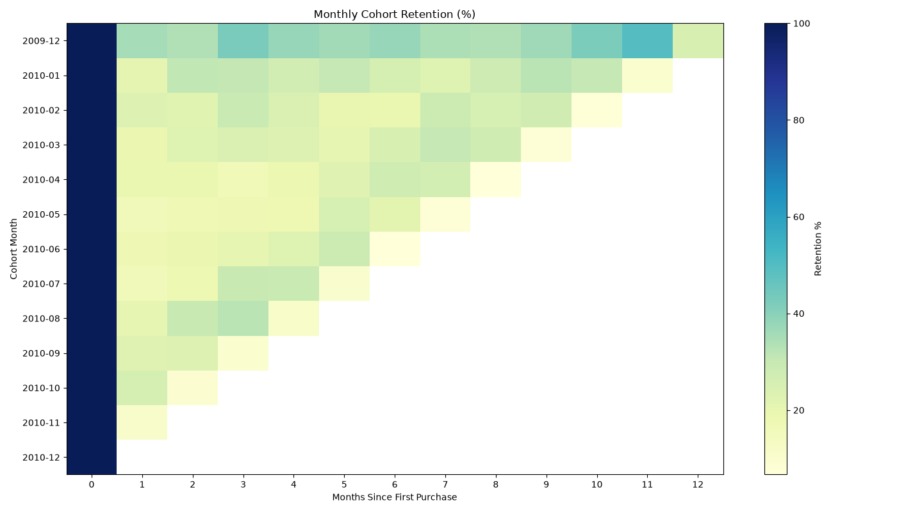
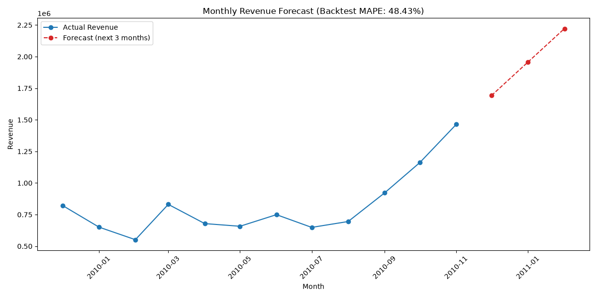

# RetailPulse — Business Insights Report

**Dataset**: Online Retail II (UK-based online retailer), December 2009 – December 2010
**Pipeline**: `python src/main.py` (see [README](../README.md) for setup)

## Executive Summary

| Metric | Value |
|---|---|
| Total revenue | £10,271,762.66 |
| Orders | 22,100 |
| Identified customers | 4,314 |
| Products | 4,316 |
| Average order value | £464.79 |
| Best month | November 2010 (£1,464,293.14) |
| Best country | United Kingdom (£8,812,311.83, 85.8% of revenue) |
| Best product | Regency Cakestand 3 Tier (£169,912.76) |
| Top customer | #18102 (£349,164.35) |

## Methodology

1. **Cleaning**: from 525,461 raw rows, removed 6,865 exact duplicates, 10,182
   cancelled invoices, 2,121 negative-quantity rows, and 3 negative-price rows,
   leaving 506,290 clean transactions (105,343 of which have no Customer ID
   and are excluded from customer-level analysis only).
2. **SQL modeling layer**: clean transactions are loaded into a local SQLite
   database (`data/processed/retail.db`, schema in `sql/01_schema.sql`).
   RFM scores are computed with `NTILE` window functions (`sql/02_rfm.sql`),
   cohort activity counts with a self-join (`sql/03_cohort_retention.sql`),
   and monthly KPIs with `LAG`/`RANK` for growth and ranking
   (`sql/04_kpis.sql`).
3. **Customer segmentation**: computed two independent ways — rule-based RFM
   quintile scoring, and K-Means clustering on standardized RFM features
   (k chosen via the elbow method) — to cross-check the shape of the customer
   base rather than relying on one method.
4. **Retention**: both a naive repeat-vs-one-time-customer metric and a
   proper monthly cohort retention matrix (percentage of each first-purchase
   cohort still active N months later).
5. **Forecasting**: Holt-Winters exponential smoothing (additive trend, no
   seasonal term), backtested on a 3-month holdout. The trailing month is
   excluded automatically because the raw data cuts off on 2010-12-09 —
   without that fix, the partial month looks like a demand crash.

## Customer Segmentation

### Rule-based RFM segments

| Segment | Customers | % of Customers | Revenue | % of Revenue | Repeat Rate |
|---|---|---|---|---|---|
| VIP / Champions | 920 | 21.3% | £5,950,360 | 67.6% | 100.0% |
| Loyal Customers | 1,026 | 23.8% | £1,723,811 | 19.6% | 99.0% |
| Potential Loyalists | 1,126 | 26.1% | £797,277 | 9.1% | 70.1% |
| At Risk | 701 | 16.3% | £228,560 | 2.6% | 22.8% |
| Lost / Hibernating | 541 | 12.5% | £98,226 | 1.1% | 1.5% |

The top fifth of customers (VIP/Champions) drives over two-thirds of all
revenue, and repeat-purchase rate falls off in lockstep with segment —
strong evidence the RFM score is capturing genuine loyalty, not noise.

### K-Means segments (k=4, elbow-selected)

| Segment | Customers | Avg Recency (days) | Avg Frequency | Avg Monetary | Total Revenue |
|---|---|---|---|---|---|
| Champions | 5 | 5.6 | 113.6 | £215,535 | £1,077,675 |
| Loyal Customers | 56 | 14.9 | 47.0 | £28,896 | £1,618,199 |
| At Risk | 3,204 | 43.0 | 4.5 | £1,711 | £5,480,923 |
| Lost | 1,049 | 243.1 | 1.7 | £592 | £621,437 |

K-Means finds the same shape independently: a tiny (5-customer) whale
cluster averaging over £215K each, a mid-tier of 56 loyal accounts, and a
long tail. Note the "At Risk" cluster still contributes the single largest
total revenue (£5.48M) purely on volume (3,204 customers) — a reminder that
per-customer value and total segment contribution answer different
questions, and campaign prioritization should look at both.

## Cohort Retention

Only **~20.5%** of customers are still purchasing one month after their
first order — far stricter than the naive repeat-customer rate of **67.1%**,
which counts any second order at any point in the dataset's 13-month window.
Cohort retention is the more actionable number for a retention campaign
because it measures whether *new* customers stick around soon after
acquisition, not just whether they ever come back.

Early cohorts (Dec 2009, Jan 2010) show somewhat higher month-1 retention
(35.3%, 20.6%) than most mid-year cohorts — worth investigating whether
early customers were acquired through a higher-intent channel, though
cohort sizes later in the year are small enough that some of this is noise.

## Revenue Forecast

The Holt-Winters model backtests at roughly 48% MAPE on a 3-month holdout —
noticeably high, and worth being explicit about why: with only ~12 clean
months of history, there isn't enough data to fit a yearly seasonal
component, so the model can't anticipate the real November/December demand
spike it hasn't seen before. **This is disclosed as a known limitation, not
hidden** — the forecast is directionally useful for near-term trend but
should not be used to size Q4 inventory or staffing without a seasonally-
aware model and a second year of history.

## Recommendations

1. **Promote Potential Loyalists → Loyal.** This segment (1,126 customers,
   70% already repeat) is the single largest lever: a modest lift in repeat
   rate here would move meaningfully more revenue into the Loyal/Champions
   tier than trying to reactivate the Lost segment.
2. **Don't over-invest in win-back for Lost/Hibernating** — 12.5% of
   customers but only 1.1% of revenue and a 1.5% repeat rate; the ROI on
   reactivation campaigns here is likely poor compared to option 1.
3. **Geographic concentration risk**: 85.8% of revenue comes from the UK
   alone. This is either a natural home-market advantage or an unexploited
   expansion opportunity — the data doesn't distinguish, but it's worth a
   dedicated look at underperforming markets.
4. **Revisit forecasting once a second year of data is available** so a
   seasonally-aware model (SARIMA with a 12-month period) can be fit
   properly instead of the current trend-only approximation.
5. **Consider a dedicated VIP program** for the K-Means "Champions" cluster
   — just 5 customers averaging £215K each is an outsized concentration of
   revenue in very few relationships.

## Limitations

- Single retailer, single ~13-month window, overwhelmingly UK — findings
  may not generalize to other markets or seasons not represented here.
- The raw source file cuts off mid-day on 2010-12-09; forecasting excludes
  that partial month, and cohorts formed in October–December 2010 are too
  young at the data's cutoff to show meaningful retention yet.
- The revenue forecast has no seasonal component (see above) — treat it as
  a trend signal, not an inventory-planning number.
